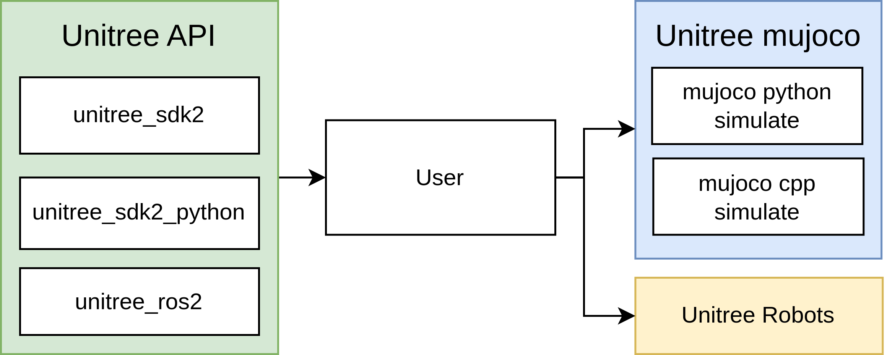

# Introduction
## Unitree mujoco
`unitree_mujoco` is a simulator developed based on `Unitree sdk2` and `mujoco`. Users can easily integrate the control programs developed with `Unitree_sdk2`, `unitree_ros2`, and `unitree_sdk2_python` into this simulator, enabling a seamless transition from simulation to physical development. The repository includes two versions of the simulator implemented in C++ and Python, with a structure as follows:


## Supported Unitree sdk2 Messages:
**Current version only supports low-level development, mainly used for sim to real verification of controller**
- `LowCmd`: Motor control commands
- `LowState`: Motor state information
- `SportModeState`: Robot position and velocity data
- `IMUState`: Torso IMU state at `rt/secondary_imu` topic (G1 only)

## Related links
- [unitree_sdk2](https://github.com/unitreerobotics/unitree_sdk2)
- [unitree_sdk2_python](https://github.com/unitreerobotics/unitree_sdk2_python)
- [unitree_ros2](https://github.com/unitreerobotics/unitree_ros2)
- [Unitree Doc](https://support.unitree.com/home/zh/developer)
- [Mujoco Doc](https://mujoco.readthedocs.io/en/stable/overview.html)

# Installation
## C++ Simulator (simulate)
### 1. Dependencies

```bash
sudo apt install libyaml-cpp-dev libspdlog-dev libboost-all-dev libglfw3-dev
```

#### unitree_sdk2
It is recommended to install `unitree_sdk2` in `/opt/unitree_robotics` path.
```bash
git clone https://github.com/unitreerobotics/unitree_sdk2.git
cd unitree_sdk2/
mkdir build
cd build
cmake .. -DCMAKE_INSTALL_PREFIX=/opt/unitree_robotics
sudo make install
```
For more details, see: https://github.com/unitreerobotics/unitree_sdk2
